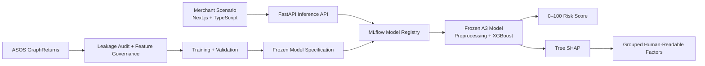

# ReturnGuard

**End-to-end ML system for predicting fashion e-commerce return risk before purchase.**

ReturnGuard takes customer and product information available at checkout, scores the purchase on a **0–100 relative return-risk scale**, and explains the model factors behind that prediction. The project was built as a production-style ML system rather than a notebook: leakage-safe feature engineering, frozen-model governance, SHAP explainability, reproducible MLflow lifecycle, FastAPI serving, and a Next.js merchant-facing UI.

> **Model note:** ReturnGuard was trained on a returner-enriched ASOS research dataset. Scores are dataset-conditional risk signals, **not merchant-wide calibrated return probabilities**.

## Highlights

- **2.83M purchase events** across train and test data
- **1.37M training events** used to build the frozen model of record
- **0.6568 ROC-AUC** and **0.6829 PR-AUC** on the held-out official test evaluation
- **0.2286 Brier score** with calibration slope **1.0012**
- **~4 ms warm single-request inference** through FastAPI
- Deterministic **MLflow model registry + reproducibility workflow**
- **Tree SHAP** explanations with feature-governance and privacy safeguards
- Full-stack demo with **FastAPI + Next.js + TypeScript**

## What ReturnGuard Does

A merchant provides the customer and product information available at purchase time:

```text
Customer context + Product context
              ↓
      Frozen preprocessing
              ↓
         XGBoost A3
              ↓
     Return Risk Score
              ↓
 Optional grouped explanation
```

The UI returns a score such as:

```text
Return Risk Score
71 / 100
```

The score is intentionally presented **without a percent sign or Low/Medium/High business bands** because the dataset does not support merchant-wide probability calibration or business-optimized thresholds.

## System Architecture



## Model Development

### 1. Leakage-safe baseline

I started with logistic regression using only purchase-time customer and product attributes. The initial audit uncovered several target-derived features that would have made validation misleading, including customer/product return aggregates and return-code fields.

**Baseline results:**

| Model | ROC-AUC | Log Loss | Brier |
|---|---:|---:|---:|
| Prevalence baseline | 0.5000 | 0.6871 | 0.2470 |
| Logistic Regression A | 0.6300 | 0.6608 | 0.2344 |
| Logistic Regression B | 0.6381 | 0.6577 | 0.2328 |

### 2. XGBoost + feature engineering

The stronger model added:

- price relative to product-type median
- price relative to brand median
- discount amount
- artifact-safe customer missingness handling

A frequency-enhanced challenger reached higher development AUC, but those frequency features could not be proven point-in-time safe because the dataset has no event timestamps. I therefore kept the more conservative model as the **model of record** rather than simply selecting the highest validation score.

### 3. Explainability + model governance

Tree SHAP was used for global and local model inspection. The final governance step checked:

- target-derived leakage
- raw identifier leakage
- missing-customer artifacts
- product-profile missingness
- suspicious feature provenance
- calibration behavior
- deterministic feature manifests

The result was a frozen **41-feature XGBoost A3** model with **659 boosting rounds** and no calibrator.

## Final Held-Out Evaluation

The frozen A3 model was evaluated once on the official ASOS test split after the model specification was locked.

| Metric | Result |
|---|---:|
| ROC-AUC | **0.656798** |
| PR-AUC | **0.682864** |
| Log Loss | **0.648265** |
| Brier Score | **0.228614** |
| ECE | **0.009677** |
| Calibration Slope | **1.0012** |

Development-to-test ROC-AUC changed by only **0.0021**, indicating that overall discrimination remained consistent after freezing the model.

### Cold-start and missing-data behavior

| Test slice | ROC-AUC |
|---|---:|
| Known customer + known product | 0.6667 |
| New customer + known product | 0.6635 |
| Known customer + new product | 0.6399 |
| New customer + new product | 0.6353 |
| Product profile available | 0.6807 |
| Product profile missing | 0.5893 |

The largest operational weakness is missing product information, which is surfaced directly to users as a data-quality warning rather than hidden behind the score.

Full methodology: [Final Test Evaluation](docs/final-test-evaluation.md)

## MLOps / Reproducibility

The model is not just saved as a local pickle. Stage 4 established a governed lifecycle around the frozen artifact:

- MLflow Tracking with local SQLite metadata
- registered model: `returnguard-a3`
- alias: `model-of-record`
- deterministic SHA256 dataset manifests
- frozen model + feature-manifest hashes
- pinned Python/package environment
- reproducible training command
- protected official-test evaluation path
- synthetic CI checks that do not require the raw ASOS dataset

Rebuild the frozen model:

```bash
.venv/bin/python scripts/reproduce_model.py --profile full
```

The workflow verifies the training-data manifest, reconstructs the fixed split and preprocessing pipeline, retrains A3, checks reference predictions, logs the artifact to MLflow, and confirms that official test data was not accessed.

More detail: [Stage 4 MLOps](docs/stage4-mlops.md)

## Inference API

The FastAPI service loads the model once from:

```text
models:/returnguard-a3@model-of-record
```

Endpoints:

```text
GET  /health
GET  /ready
GET  /model
POST /predict
POST /predict/batch
POST /explain
```

Example raw request:

```json
{
  "customer_profile": {
    "yearOfBirth": 1988,
    "isMale": false,
    "shippingCountry": "Country_A",
    "premier": true
  },
  "product_profile": {
    "productType": "Jeans",
    "brandDesc": "Brand_A",
    "avgGbpPrice": 54.99,
    "avgDiscountValue": 15.0
  }
}
```

The service performs preprocessing inside the frozen artifact and returns the score, data-quality warnings, safe provenance, and optional grouped explanations. Raw SHAP values, donor-imputed demographics, filesystem paths, and internal feature names are never exposed publicly.

Measured warm local latency:

| Operation | p50 | p95 |
|---|---:|---:|
| Single prediction | 4.15 ms | 4.66 ms |
| 100-row batch | 6.04 ms | 6.70 ms |
| Explanation | 6.78 ms | 7.01 ms |

More detail: [Stage 5 API](docs/stage5-api.md)

## Frontend

The Next.js frontend provides a single merchant scenario workflow:

1. Enter customer and product information
2. Analyze return risk
3. View the `N / 100` score and data-quality warnings
4. Optionally request **Why this score?**
5. View grouped factors associated with higher/lower predicted risk

The frontend also includes synthetic demo presets for complete, missing-customer, and incomplete-product scenarios.

Design choices intentionally avoid probability-style wording, unsupported risk bands, and causal explanation language.

More detail: [Stage 6 Frontend](docs/stage6-frontend.md)

## Tech Stack

**Machine Learning**

`Python` · `pandas` · `NumPy` · `scikit-learn` · `XGBoost` · `SHAP`

**MLOps**

`MLflow` · `pytest` · `Ruff` · `GitHub Actions`

**Backend**

`FastAPI` · `Pydantic` · `Uvicorn`

**Frontend**

`Next.js` · `React` · `TypeScript` · `Tailwind CSS` · `Zod` · `React Hook Form` · `Vitest`

## Key Engineering Decisions

### Preventing leakage instead of chasing AUC

The supplied dataset contains return/sales aggregates that leak outcome information. Product-side aggregates are even identical across train/test node files. These features were excluded instead of taking the artificially stronger performance.

### Customer-grouped validation

A large share of test purchases involve customers unseen during training. Validation therefore groups by customer rather than randomly splitting events, making the development setting closer to the cold-start behavior encountered in the official test set.

### Missing-customer artifact defense

Simple median/mode imputation made customer-node absence almost perfectly detectable by a leakage probe (**AUC 0.9866**). Joint donor imputation reduced detectability to approximately chance (**AUC 0.5248**), preventing the tree model from exploiting the preprocessing artifact.

### Conservative model governance

A higher-AUC challenger used product-frequency features, but the dataset has no timestamps to establish point-in-time correctness. Rather than silently accepting that uncertainty, the frequency-free A3 became the model of record and A4 remained experimental.

## Dataset

ReturnGuard uses the public **ASOS GraphReturns** research dataset:

- 1,369,133 training purchase events
- 1,460,366 test purchase events
- customer-node attributes
- product-node attributes

The dataset contains only customers with at least one return, resulting in an approximately 55% return prevalence. Because that is not representative of a typical merchant customer population, ReturnGuard outputs should be interpreted as **relative risk signals**, not deployable probability estimates.

Raw data is intentionally excluded from Git.

## Run Locally

### Backend / ML environment

```bash
python3 -m venv .venv
.venv/bin/pip install -r requirements.txt -c constraints-stage5.txt
```

After creating the governed local MLflow model-of-record:

```bash
.venv/bin/uvicorn backend.main:app --reload
```

API docs:

```text
http://localhost:8000/docs
```

### Frontend

```bash
cd frontend
npm install
cp .env.example .env.local
npm run dev
```

Open:

```text
http://localhost:3000
```

## Testing

Backend / ML:

```bash
ruff check .
pytest -m "not raw_training_data and not historical_test_data and not full_rebuild and not local_registry"
```

Frontend:

```bash
cd frontend
npm run lint
npm run typecheck
npm run test -- --run
npm run build
```

GitHub Actions runs data-free Python and frontend checks without requiring ASOS files or local MLflow state.

## Repository Structure

```text
ReturnGuard/
├── backend/       # FastAPI inference service
├── frontend/      # Next.js merchant-facing UI
├── ml/            # data, features, models, evaluation, explainability, governance
├── scripts/       # audits, training, Stage 3 analysis, lifecycle workflows
├── artifacts/     # versioned manifests + safe reference fixtures
├── docs/          # methodology, model card, evaluation and stage docs
├── reports/       # curated evaluation evidence
└── tests/         # ML, governance, lifecycle and API tests
```

## Limitations

ReturnGuard is a research/portfolio system, not a production merchant decision engine. Current limitations include:

- returner-enriched rather than merchant-representative data
- no timestamps for true temporal validation
- weaker performance when product information is unavailable
- residual uncertainty for donor-imputed missing customer profiles
- anonymized category values that do not directly map to a real merchant taxonomy
- no merchant-specific calibration or business-loss thresholding

These limitations are intentionally surfaced in the model card, API, and frontend rather than hidden.

## Documentation

- [Dataset Audit](docs/dataset-audit.md)
- [Leakage Audit](docs/leakage-audit.md)
- [Stage 1 Baseline](docs/stage1-baseline.md)
- [Stage 2 XGBoost](docs/stage2-gbdt.md)
- [Stage 3 Explainability & Governance](docs/stage3-methodology.md)
- [Final Test Evaluation](docs/final-test-evaluation.md)
- [Stage 4 MLOps](docs/stage4-mlops.md)
- [Stage 5 API](docs/stage5-api.md)
- [Stage 6 Frontend](docs/stage6-frontend.md)
- [Model Card](docs/model-card.md)
- [Evaluation History](docs/evaluation-history.md)
